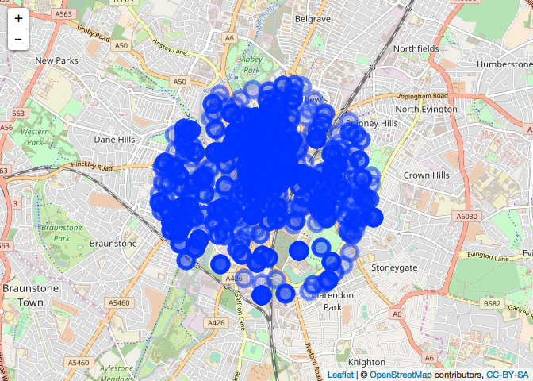

<!-- README.md is generated from README.Rmd. Please edit that file -->
ukpolice
========

[](https://ci.appveyor.com/project/njtierney/ukpolice)[](https://travis-ci.org/njtierney/ukpolice)[](https://codecov.io/github/njtierney/ukpolice?branch=master)

ukpolice is an R package that facilitates retrieving data from the [UK police database.](https://data.police.uk/)

The data provided by the API contains public sector information licensed under the [Open Government Licence v3.0.](http://www.nationalarchives.gov.uk/doc/open-government-licence/version/3/)

This package is in a very beta stage, and I'm still learning a lot about APIs!

Installation
============

Install from GitHub

``` r

#install.packages("devtools")
devtools::install_github("njtierney/ukpolice")
```

Usage
=====

Neighbourhood
-------------

`ukp_neighbourhood()`, retrieves a list of neighbourhoods for a force, <https://data.police.uk/docs/method/neighbourhoods/>

This returns a tibble with columns `id` and `name`.

``` r

library(ukpolice)
ukp_neighbourhood("leicestershire")
#> No encoding supplied: defaulting to UTF-8.
#> # A tibble: 67 × 2
#>       id                           name
#>    <chr>                          <chr>
#> 1   NC04                    City Centre
#> 2   NC66               Cultural Quarter
#> 3   NC67                      Riverside
#> 4   NC68                 Clarendon Park
#> 5   NE09                 Belgrave South
#> 6   NE10                 Belgrave North
#> 7   NE11                    Rushey Mead
#> 8   NE12                    Humberstone
#> 9   NE13 Northfields, Tailby and Morton
#> 10  NE14                     Thurncourt
#> # ... with 57 more rows
```

-   `id` is a Police force specific team identifier, (note that this identifier is not unique and may also be used by a different force).
-   `name` is the name for the neighbourhood.

Crime
-----

`ukp_crime()` draws crimes from within a one mile radius of the location.

When no date is specified, it uses the latest month available, which can be found using `ukp_last_update()`.

``` r

crime_data <- ukp_crime(lat = 52.629729, lng = -1.131592)
#> No encoding supplied: defaulting to UTF-8.

head(crime_data)
#> # A tibble: 6 × 12
#>                category persistent_id    date latitude longitude street_id
#>                   <chr>         <chr>   <chr>    <dbl>     <dbl>     <chr>
#> 1 anti-social-behaviour               2016-08 52.63247 -1.134164    883334
#> 2 anti-social-behaviour               2016-08 52.62929 -1.144983   1319949
#> 3 anti-social-behaviour               2016-08 52.62749 -1.118661    883201
#> 4 anti-social-behaviour               2016-08 52.62749 -1.118661    883201
#> 5 anti-social-behaviour               2016-08 52.63716 -1.112261    883042
#> 6 anti-social-behaviour               2016-08 52.63055 -1.154784    883561
#> # ... with 6 more variables: street_name <chr>, context <chr>, id <chr>,
#> #   location_type <chr>, location_subtype <chr>, outcome_status <chr>

ukp_last_update()
#> No encoding supplied: defaulting to UTF-8.
#> [1] "2016-08"
```

When date is specified, it must be in the format "YYYY-MM". Currently `ukp_crime()` only allows for searching of that current month.

``` r

crime_data_date <- ukp_crime(lat = 52.629729, 
                        lng = -1.131592,
                        date = "2016-03")
#> No encoding supplied: defaulting to UTF-8.

head(crime_data_date)
#> # A tibble: 6 × 12
#>                category persistent_id    date latitude longitude street_id
#>                   <chr>         <chr>   <chr>    <dbl>     <dbl>     <chr>
#> 1 anti-social-behaviour               2016-03 52.63654 -1.128602    883356
#> 2 anti-social-behaviour               2016-03 52.64332 -1.123841    884316
#> 3 anti-social-behaviour               2016-03 52.63354 -1.126977    883379
#> 4 anti-social-behaviour               2016-03 52.62766 -1.149757    883457
#> 5 anti-social-behaviour               2016-03 52.62766 -1.149757    883457
#> 6 anti-social-behaviour               2016-03 52.63981 -1.139118    883235
#> # ... with 6 more variables: street_name <chr>, context <chr>, id <chr>,
#> #   location_type <chr>, location_subtype <chr>, outcome_status <chr>
```

This is still a little buggy at the moment as it returns blank columns for variables like `persistent_id` and `context`, `location_subtype`, and `outcome_status`. This issue is currently logged at [issue \#11](https://github.com/njtierney/ukpolice/issues/11).

Examples
========

Explore the number of crime types
---------------------------------

``` r

library(dplyr)
library(ggplot2)

crime_data <- ukp_crime(lat = 52.629729, lng = -1.131592)
#> No encoding supplied: defaulting to UTF-8.

crime_data %>%
  count(category) %>%
  ggplot(aes(x = reorder(category, n),
             y = n)) + 
  geom_col() + 
  labs(x = "Crime Type",
       y = "Number of Crimes",
       title = paste0("Crimes commited in ",crime_data_date$date[1])) +
  coord_flip() +
  theme_minimal()
```


Use leaflet
-----------

You can add a popup that displays the crime type using the `popup` argument in leaflet.

``` r
library(leaflet)
crime_data <- ukp_crime(lat = 52.629729, lng = -1.131592)
#> No encoding supplied: defaulting to UTF-8.
crime_data %>%
  leaflet() %>%
  addTiles() %>%
  addCircleMarkers(popup = ~category)
#> Assuming 'longitude' and 'latitude' are longitude and latitude, respectively
```



Code of Conduct
---------------

Please note that this project is released with a [Contributor Code of Conduct](CONDUCT.md). By participating in this project you agree to abide by its terms.
